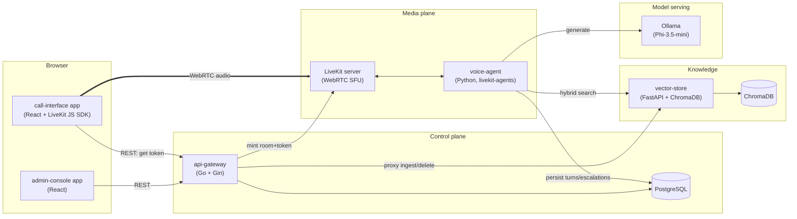

# Architecture

This is entregable **02 (diagrama)**'s source. The rubric explicitly spot-checks that
this diagram corresponds to what's actually in `services/` — when a service's
responsibilities change, update this file in the same commit, not after the fact.

Full rationale for each decision below lives in
[`specs/implementation-plan.md`](../specs/implementation-plan.md) §1–§2; this file is the
diagram + a short pointer, not a duplicate of that reasoning.

## Service responsibilities

| Service | Responsibility |
|---|---|
| `admin-console` | Standalone app: document CRUD + processing status |
| `call-interface` | Standalone app: start call, mic, listen, reconnect on drop |
| `api-gateway` | Control-plane REST API: call lifecycle, document CRUD proxy, escalation/summary reads, LiveKit token minting, OpenAPI docs |
| `voice-agent` | Real-time pipeline: VAD → STT → hybrid retrieval → generation → decision fusion → TTS; persists turns/escalations/summaries |
| `vector-store` | Ingestion (parse/chunk/embed), hybrid (dense + BM25) search, versioning, soft delete |
| `ollama` | Serves the declared G3 model (Phi-3.5-mini by default) over an OpenAI-compatible API |
| `livekit` | WebRTC SFU: room/participant management, media transport |
| `postgres` | Transactional store: documents, calls, turns, escalations, summaries |

See `specs/implementation-plan.md` §4 for the exact request/response contracts between
these services, and `docs/decision-flow.md` for the escalation logic diagram (the second
half of entregable 02).

<!-- TODO(workstream F): once the call summary UI / alerts view exists in the admin
console, add a short "what the jury sees" walkthrough here linking screenshots, since the
rubric rewards a demo that's clearly traceable back to this diagram. -->
