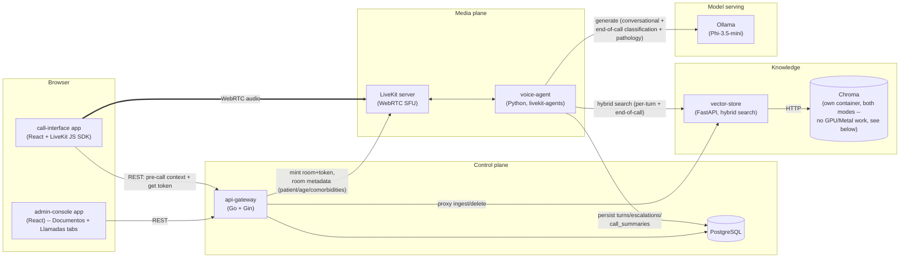

# Architecture

This is entregable **02 (diagrama)**'s source. The rubric explicitly spot-checks that
this diagram corresponds to what's actually in `services/` — when a service's
responsibilities change, update this file in the same commit, not after the fact.

Full rationale for each decision below lives in
[`specs/implementation-plan.md`](../specs/implementation-plan.md) §1–§2; this file is the
diagram + a short pointer, not a duplicate of that reasoning.

## Why Chroma is its own container, in both native and full-Docker mode

Found live, the hard way: an early version ran Chroma as an embedded `PersistentClient`
*inside* vector-store's own process. That works, but it means Chroma silently "follows"
whatever execution environment vector-store happens to run in — and on macOS,
vector-store has to run natively (not in Docker) to get Metal acceleration for the
BGE-M3 embedding model (Docker Desktop cannot pass through Metal, full stop). Moving
vector-store native took the *entire* embedded Chroma instance out of Docker with it,
even though Chroma itself does zero GPU/Metal work and had no reason to leave. Fixed by
running Chroma as the official `chromadb/chroma` server image — a real, inspectable,
independently-restartable container in *both* modes, matching the same treatment already
given to postgres/livekit — with vector-store (native or containerized, depending on
mode) talking to it over plain HTTP. See `services/vector-store/README.md` for the full
account, including a second, related bug this surfaced (ChromaDB's client not being
thread-safe under concurrent access).

## Service responsibilities

| Service | Responsibility |
|---|---|
| `admin-console` | Standalone app: document CRUD + processing status ("Documentos" tab); per-call final classification, six signals, triage, KB-grounded pathology validation with clickable evidence ("Llamadas" tab) |
| `call-interface` | Standalone app: optional pre-call context (name/age/known conditions), start call, mic, live agent-presence visualization, listen, reconnect on drop |
| `api-gateway` | Control-plane REST API: call lifecycle (incl. ad-hoc anonymous-caller context), document CRUD proxy, call/escalation/summary reads, LiveKit token minting + room metadata, OpenAPI docs |
| `voice-agent` | Real-time pipeline: VAD → STT → hybrid retrieval → generation → per-turn rule-layer safety net → TTS, turn-index-driven topic script with a bounded missing-topic makeup round; at call end, one comprehensive classification pass + a separate KB-grounded pathology validation pass; persists turns/escalations/summaries |
| `vector-store` | Ingestion (parse/chunk/embed), hybrid (dense + BM25) search, versioning, soft delete -- talks to Chroma over HTTP, doesn't embed it |
| `Chroma` | Vector storage/search engine, own container (official image), reused by every mode since it does no GPU/Metal work |
| `ollama` | Serves the declared G3 model (Phi-3.5-mini by default) over an OpenAI-compatible API |
| `livekit` | WebRTC SFU: room/participant management, media transport |
| `postgres` | Transactional store: documents, calls (incl. ad-hoc anonymous-caller context), turns, escalations, call summaries (six signals + final triage + pathology validation) |

See `specs/implementation-plan.md` §4 for the exact request/response contracts between
these services, and `docs/decision-flow.md` for the escalation/classification logic
diagram (the second half of entregable 02, reworked from a per-turn design to a
per-turn-safety-net + end-of-call-classification split — see that file for why).

## Knowledge base bootstrap: seed-first, not re-ingest-first

`scripts/setup.sh` never re-runs the full OCR+embedding pipeline over the given corpus if
it doesn't have to. On a machine that already has one (a prior run, or a restored
volume), it's a no-op. On a genuinely fresh machine, it restores from a pre-computed
snapshot (`kb-seed.tar.gz`, built once via `scripts/export_kb_seed.sh`) in seconds rather
than paying the ~24-minute OCR+BGE-M3 cost live — schema migrations run early
(via the `migrate/migrate` image, before either Postgres or Chroma get real traffic) so
the seed-restore's own "is the DB already populated?" check is meaningful on a genuinely
empty database, not just a fresh-looking one. Only if no seed file is present at all does
the real, live bulk-ingest pipeline run — see the root README's "Desde cero" section for
the exact sequence a grader/new machine goes through.
