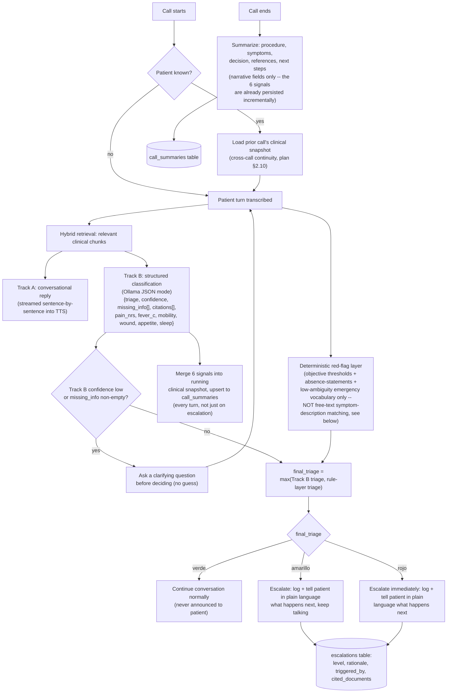

# Decision / escalation flow

Second half of entregable **02**. Rationale in
[`specs/implementation-plan.md`](../specs/implementation-plan.md) §2.3 — the short version
is: escalation is never LLM-only, because a missed escalation (false negative) is scored
as the worst possible failure in the rubric, and the rule layer can only push severity
*up*, never down. The triage classification itself is **private** — the agent leads a
routine check-in conversation and never announces "verde/amarillo/rojo" out loud; when it
escalates, the spoken reply says what happens next in plain language instead.

## Notes for whoever implements this (workstream C)

- `triggered_by` on the `escalations` row must record whether Track B, the rule layer, or
  both fired — this is what lets the informe show "the rule layer caught a case the model
  missed" as evidence the asymmetric-risk design actually works, not just a claim.
- The clarifying-question branch (`E -- yes`) is what the rubric's "¿indaga antes de
  decidir?" descriptor is checking for — don't let the model silently guess when Track B
  itself reports low confidence.
- **Red-flag rule table scope, stated plainly because a first version got this wrong**:
  `services/voice-agent/app/decision.py` is scoped to objective numeric thresholds,
  structurally rigid absence-statements ("no orino"), low-ambiguity emergency vocabulary,
  and a few narrow category-specific domain correlations — **not** free-text symptom
  *description* matching (what does wound infection sound like in lay speech). That
  turned out to be a losing game against "lenguaje cotidiano, ambiguo y regional" (the
  challenge's own framing): every phrasing caught invites a slightly different one that
  isn't. That recognition job belongs to Track B, grounded by retrieval — see that
  module's docstring for the concrete mistake (and the concrete false positive) that
  established this boundary.
- The six structured signals (`pain_nrs`, `fever_c`, `mobility`, `wound`, `appetite`,
  `sleep`) persist to `call_summaries` after **every** turn via
  `db.upsert_clinical_snapshot`, COALESCE-merged so a turn that doesn't mention a signal
  never nulls out what an earlier turn established — this is what "keep all the relevant
  patient context for the agent at any point in time" actually means operationally, not
  just within one call but carried forward to the next one for the same patient
  (`db.fetch_latest_snapshot_for_patient`).

<!-- TODO(workstream C): once real test cases exist (verde/amarillo/rojo examples from
dataset_final.xlsx's label_ground_truth), link a short table here of "case → expected
triage → actual triage" as running evidence for the informe. -->
