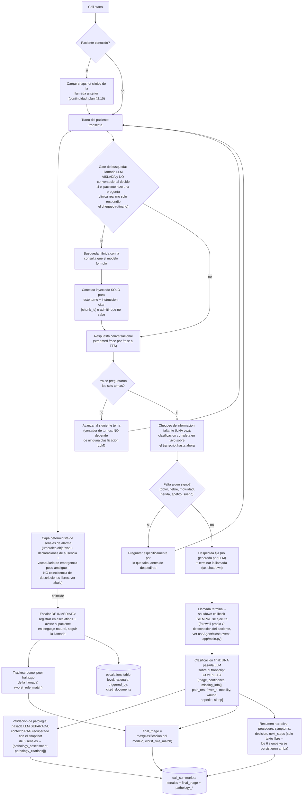

# Decision / escalation flow

Second half of entregable **02**. Rationale in
[`specs/implementation-plan.md`](../specs/implementation-plan.md) §2.3 — the short version
is: escalation is never LLM-only, because a missed escalation (false negative) is scored
as the worst possible failure in the rubric, and the rule layer can only push severity
*up*, never down. The triage classification itself is **private** — the agent leads a
routine check-in conversation and never announces "verde/amarillo/rojo" out loud; when it
escalates, the spoken reply says what happens next in plain language instead.

> **Reworked from the original per-turn design.** The first version ran a structured
> classification call (then called "Track B") on *every* patient turn, concurrently with
> the conversational reply ("Track A"). Found live: both calls competed for the same local
> Ollama instance, causing real timeouts and dropped connections mid-call. Reworked to run
> the deterministic rule layer per-turn (cheap, not an LLM call) and move the LLM-based
> classification to a single comprehensive pass at call end, over the complete transcript
> — which is also more accurate than any single turn judged in isolation (a clarification
> given three turns later can correct what an earlier turn suggested).

## Por que la busqueda en la base de conocimiento esta *acotada*, no ausente ni siempre encendida

Tres versiones distintas, en este orden, cada una descartada por evidencia en vivo:

1. **Busqueda incondicional en cada turno** (version original): agrupaba la respuesta
   conversacional con contexto RAG recuperado con el texto crudo del paciente, siempre.
   Encontrado en vivo: para una llamada sin categoria de procedimiento conocida, una
   pregunta generica del chequeo (ej. "movilidad") podia coincidir con seguridad pero
   totalmente fuera de categoria contra el corpus (que abarca ~5 categorias quirurgicas
   muy distintas), y el modelo desviaba la conversacion hacia un monologo fuera de guion
   de varios minutos en vez de simplemente seguir preguntando.
2. **Sin busqueda en absoluto durante la llamada**: la correccion inicial a (1) fue
   eliminar por completo la busqueda en vivo. Esto rompio el requisito de la rubrica
   sobre RAG (20 pts): respuestas clinicas demostrablemente basadas en el corpus,
   trazables a un documento real, con un limite honesto declarado cuando la respuesta no
   esta documentada -- nada de eso puede pasar si nunca se consulta la base de
   conocimiento durante la llamada.
3. **Gate de decision, aislado del turno conversacional** (diseño actual): el modelo NO
   tiene funcion nativa de "tool calling" (confirmado en vivo: Ollama reporta las
   capacidades de `phi3.5:3.8b` como `["completion"]` unicamente, y rechaza una llamada
   de herramientas real de plano) -- el equivalente practico es una llamada LLM SEPARADA,
   pequeña y de un solo proposito (`SEARCH_DECISION_PROMPT_ES`, mismo patron que
   `FINAL_CLASSIFICATION_PROMPT_ES`/`PATHOLOGY_VALIDATION_PROMPT_ES`) que decide, por
   turno, si lo que dijo el paciente es una pregunta clinica real -- nunca para las seis
   preguntas rutinarias del chequeo. Solo entonces corre la busqueda, con la consulta que
   el propio modelo formulo, y el contexto se inyecta SOLO para esa respuesta. Los
   `chunk_id` citados se persisten en `turns.retrieved_chunk_ids` para esa respuesta
   especifica -- la trazabilidad que pide la rubrica, sin volver a la busqueda
   incondicional que causo (1).

## Por que la capa de reglas sigue siendo por-turno

La clasificacion LLM se movio a una sola pasada al final de la llamada (ver arriba), pero
la capa determinista (`services/voice-agent/app/decision.py`) sigue corriendo en **cada**
turno, en tiempo real, independiente de cuando corra la clasificacion del modelo — no es
una llamada LLM, es barata, y es la red de seguridad que puede escalar de inmediato sin
esperar a que la llamada termine. `final_triage` es el maximo entre el hallazgo mas grave
de esta capa a lo largo de TODA la llamada y la clasificacion del modelo al final —
`decision.fuse()`.

## Por que la clasificacion final corre dos veces (en vivo y al cerrar)

Antes de decir la despedida, el agente corre la MISMA extraccion de 6 senales una vez, en
vivo, solo para decidir si falta informacion clave (`missing_fields()`) y, si es asi,
volver a preguntar antes de cerrar — esto es lo que "si el agente considera que una
pregunta no fue respondida, debe poder volver a introducirla antes de cerrar la llamada"
significa en la practica. Esa pasada en vivo es solo para CONTROL DE FLUJO; la fuente de
verdad que se persiste es la clasificacion que corre de nuevo en `summarize_call`, sobre
el transcript ya completo (incluida cualquier respuesta de la ronda de recuperacion).

## Notas para quien siga trabajando esto (workstream C)

- `triggered_by` en la fila de `escalations` registra si fue la capa de reglas, el modelo,
  o ambos — esto es lo que permite mostrar en el informe "la capa de reglas atrapo un caso
  que el modelo no vio" como evidencia de que el diseño de riesgo asimetrico realmente
  funciona, no solo una afirmacion.
- **Alcance de la tabla de reglas de alarma, dicho claramente porque una primera version
  se equivoco en esto**: `services/voice-agent/app/decision.py` esta acotado a umbrales
  numericos objetivos, declaraciones de ausencia estructuralmente rigidas ("no orino"),
  vocabulario de emergencia poco ambiguo, y unas pocas correlaciones de dominio
  especificas por categoria — **no** coincidencia de *descripciones* libres de sintomas
  (como suena una infeccion de herida en lenguaje coloquial). Eso resulto ser un juego
  perdido contra "lenguaje cotidiano, ambiguo y regional" (el marco del propio reto): cada
  frase que se atrapa invita a otra ligeramente distinta que no se atrapa. Ese trabajo de
  reconocimiento es del modelo, con contexto recuperado (RAG) — ver el docstring de ese
  modulo para el error concreto (y el falso positivo concreto) que establecio este limite.
- Los seis signos estructurados (`pain_nrs`, `fever_c`, `mobility`, `wound`, `appetite`,
  `sleep`) se persisten en `call_summaries` con COALESCE-merge, para que un turno que no
  menciona un signo nunca anule lo que un turno anterior ya establecio — esto es lo que
  "mantener todo el contexto relevante del paciente en cualquier momento" significa en la
  practica, no solo dentro de una llamada sino llevado a la siguiente para el mismo
  paciente (`db.fetch_latest_snapshot_for_patient`).
- La validacion de patologia (`pathology_assessment`/`pathology_evidence`) es una llamada
  LLM SEPARADA de la clasificacion de los 6 signos, no campos extra en el mismo prompt —
  se probo combinarlas primero y, en vivo, un modelo de ~3.8B dejaba de seguir el schema
  JSON por completo en cuanto se agregaba tambien contexto de la base de conocimiento al
  mismo prompt. Un prompt corto y de un solo proposito, con la misma disciplina que ya
  aplica el resto de `app/prompts.py`, es lo que lo mantiene confiable.

<!-- TODO(workstream C): once real test cases exist (verde/amarillo/rojo examples from
dataset_final.xlsx's label_ground_truth), link a short table here of "case → expected
triage → actual triage" as running evidence for the informe. -->
