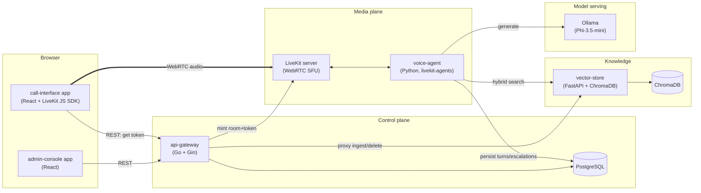

# Implementation Plan — Post-surgical voice agent (Tech Sphere 2026)

Companion to [`scaffolding.md`](./scaffolding.md). Source of truth for anyone (human or
subagent) picking up a workstream below — read §4 (contracts) before writing code against
a service you don't own.

## 0. Non-negotiable constraints (from `ParticipantArtifacts/docs/`)

These come from the actual grading rubric, not from `scaffolding.md`, and override any
convenience shortcut below:

- **G1** — repo, diagram, informe, video, all four, before anything else is scored.
- **G2** — `git clone` → running, from the README alone, **≤ 15 minutes**, timed. Model
  downloads count against this clock.
- **G3** — the reasoning LLM must be from an allowed family (Gemini Flash / Llama via
  Groq / Llama 3.x 1B–3B local / **Phi Mini 3.5+ local**, the one we're using) and this
  must be declared in the informe. Everything else (STT, TTS, embeddings, vector DB,
  orchestration) is unrestricted.
- **G4** — live two-way voice conversation, verified with a trivial exchange.
- **G5** — upload a doc from the console → agent uses it; delete it → agent forgets it,
  tested with a document outside the given corpus.
- **Clinical asymmetry** — a missed escalation (false negative) is the worst possible
  failure, scored far more harshly than a false alarm. Every escalation-adjacent design
  decision below is biased toward over-escalating, never under-escalating.
- README must report, verifiably against logs: **P50/P95 latency** (end of patient
  speech → start of agent audio), **tokens in/out per turn and per call**, **model calls
  per turn**, **RAG queries per call**, **estimated cost per call**.

Today (2026-08-08) sits inside the official build window (7–10 ago). The scope decision
on record is "build the full architecture," not an MVP cut — but the phase ordering in
§6 is still sequenced so that a gate-passing, submittable state exists as early as
possible. Treat §6's phase boundaries as safe checkpoints, not scope limits.

---

## 1. Architecture overview



**Why this shape, not a monolith:** `scaffolding.md` explicitly asks to decouple model
serving, vector storage, and the main API into separate services. The one addition beyond
that suggestion is **LiveKit as the WebRTC layer**, chosen over hand-rolled
Pion/signaling/ICE/jitter-buffer code because:

1. Full WebRTC (the chosen transport) is a large amount of genuinely hard, latency- and
   correctness-sensitive code (NAT traversal, echo cancellation, adaptive jitter
   buffering, barge-in/interruption handling) that a self-hosted, MIT-licensed,
   Docker-shippable SFU already solves.
2. `livekit-agents` (Python) gives us VAD, turn-detection, and interruption handling as
   library primitives instead of custom state machines — directly relevant to the
   "quality of voice conversation" rubric criterion (silences, interruptions, adversarial
   audio).
3. It keeps the real-time hot path to two network hops beyond the in-process pipeline
   (vector-store search, Ollama generate) — everything latency-critical (STT when local,
   TTS) runs in-process inside `voice-agent`, not as an extra service hop.

This is a genuine architecture decision with alternatives considered — worth citing
verbatim as the answer to the video's Question 2 (technical decision + alternatives +
risks).

### Service list

Frontend is **two separate apps, not one SPA with two routes** — revised from the initial
plan. The challenge rules allow either ("pueden ser una sola aplicación o dos"), but
separate is the more defensible choice once the two surfaces have different audiences and
(eventually) different auth postures: a patient starting a call never authenticates,
while an admin console that can delete clinical knowledge is a different trust boundary
even under this challenge's explicit no-auth scope (§2.7).

| Service | Language/runtime | Responsibility | Talks to |
|---|---|---|---|
| `call-interface` | React + Vite + TS | Standalone app: start call, mic, listen, reconnect on drop | `api-gateway`, `livekit` (via JS SDK) |
| `admin-console` | React + Vite + TS | Standalone app: document CRUD + processing status | `api-gateway` |
| `api-gateway` | Go + Gin | REST control plane: call lifecycle, document CRUD proxy, escalation/summary reads, OpenAPI docs, LiveKit token minting, schema migrations | `postgres`, `vector-store`, `livekit` |
| `voice-agent` | Python + `livekit-agents` | Real-time pipeline: VAD → STT → retrieve → generate → decide → TTS; writes turns/escalations/summaries | `livekit`, `vector-store`, `ollama`, `postgres` |
| `vector-store` | Python + FastAPI + ChromaDB | Ingestion (parse/chunk/embed), hybrid search, versioning, soft delete | `chromadb` (embedded or its own container) |
| `ollama` | Ollama (Go binary) | Serves Phi-3.5-mini via OpenAI-compatible API; GPU/Metal/CPU auto | — |
| `livekit` | LiveKit server (Go binary, official image) | WebRTC SFU, room/token auth | — |
| `postgres` | PostgreSQL | Transactional data: documents, calls, turns, escalations, summaries | — |

---

## 2. Key technical decisions and rationale

### 2.1 LLM: Phi-3.5-mini via Ollama, behind a provider interface

Default and declared-in-informe model: `phi3.5:3.8b` (or the current successor tag in
the same family, per the stack doc's "families not snapshots" note — pin whatever
resolves at build time and log the resolved tag). Implemented behind a small
`LLMProvider` interface in `voice-agent` (`generate(messages, stream) -> tokens`,
`classify(context) -> {triage, confidence}`), with `OllamaProvider` as the only
implementation initially. This directly satisfies `scaffolding.md`'s "should be able to
handle multiple models and vendors, and switch between them as needed" and gives a clean,
honest answer if asked "what would you change with two more weeks": wire up
`GeminiFlashProvider` / `GroqLlamaProvider` behind the same interface for a cloud fallback
path.

### 2.2 STT: dual-mode, config toggle

- `groq` (default for the live demo): Groq Cloud Whisper Large V3, HTTP call from
  `voice-agent`. Near-instant, explicitly the reason Groq is in the stack doc.
- `local`: `faster-whisper` (CTranslate2), in-process in `voice-agent`, CPU or Metal/CUDA
  via the same hardware-detection logic as §2.5. Offline fallback and a legitimate answer
  to "what if there's no internet during grading."
- Selected via `STT_MODE` env var, same `STTProvider` interface pattern as the LLM.
  Latency and cost are logged per-turn regardless of mode, so the README's required
  metrics table works unmodified either way.

### 2.3 Escalation logic: hybrid, asymmetric-safe

Given "false negative is catastrophic" is an explicit, heavily-weighted rubric principle,
escalation decisions are **never LLM-only**:

1. **Track A (conversational)** — the model streams a natural-language Spanish reply,
   sentence-chunked straight into TTS as it generates, so audio starts before the full
   response is done. This is what keeps perceived latency low.
2. **Track B (classification)** — a concise structured pass (Ollama JSON-mode) over the
   same turn context produces `{triage: verde|amarillo|rojo, confidence, missing_info[],
   citations[], pain_nrs, fever_c, mobility, wound, appetite, sleep}` — the last six
   mirror the reference dataset's own trajectory taxonomy (docs/dataset-eda.md §3) and
   feed the running clinical snapshot (§3.1, §2.10), not just the triage decision.
3. **Deterministic red-flag layer** — scoped narrower than a first pass attempted, after
   a real mistake surfaced the right boundary: only objective numeric thresholds (an
   explicit temperature), structurally rigid absence-statements ("no orino", "no puedo
   apoyar"), low-ambiguity emergency vocabulary (chest pain, heavy bleeding, stated
   confusion), and a few narrow non-obvious domain correlations (referred shoulder pain
   post-cholecystectomy). Free-text symptom-*description* pattern matching (what wound
   discharge sounds like in lay speech) was tried and removed — "lenguaje cotidiano,
   ambiguo y regional" (the challenge's own framing) is an unbounded paraphrase space,
   and a regex chasing it just adds false-positive surface without closing the gap; that
   recognition is Track B's job, grounded by retrieval. See
   `services/voice-agent/app/decision.py`'s module docstring for the full reasoning and
   the concrete false positive (a benign sentence mentioning both "herida" and "liquido")
   that motivated pulling this back.
4. **Fusion rule**: `final_triage = max(track_B_triage, rule_layer_triage)` — the rule
   layer can only escalate, never downgrade what the model said. Every escalation event
   persists `rationale`, which layer triggered it, and the cited chunk IDs, satisfying
   both the escalation and traceability rubric criteria at once.
5. When Track B or the rule layer is ambiguous (low confidence, conflicting signals), the
   agent is prompted to **ask a clarifying question before deciding** rather than
   guessing — directly answers "¿indaga antes de decidir?" from the rubric.
6. The triage classification is **never spoken to the patient** — the agent leads a
   routine check-in conversation and privately infers whether staff should be notified;
   Track B's output drives escalation logic and the call summary, not the dialogue
   (`app/prompts.py`'s docstring). When escalating, the spoken reply states the next step
   in plain language, never the verde/amarillo/rojo label itself.

### 2.4 Hybrid retrieval, versioning, soft delete

- **Dense**: BGE-M3 embeddings (via `FlagEmbedding` or `sentence-transformers`), stored in
  ChromaDB.
- **Sparse**: BM25 over the same chunk text (`rank_bm25`, or SQLite FTS5 if we want it
  queryable via SQL too).
- **Fusion**: Reciprocal Rank Fusion (RRF) over the two result lists — simple, tuning-free,
  good default for a 2-source hybrid.
- **Identity**: `api-gateway`/Postgres owns `document_id` (source of truth for identity);
  `vector-store` is a processing/index engine, not an ID authority. Every chunk in Chroma
  carries `{document_id, version, status}` metadata.
- **Versioning**: `PUT /documents/{id}` (not another `POST /documents`, which always
  creates a brand-new, unrelated document) uploads a new version of an EXISTING
  document_id — increments `documents.current_version`, inserts a new
  `document_versions` row, and re-runs the full extract→chunk→embed pipeline; Chroma's
  `upsert_chunks` flips the prior version's chunks to `status=superseded`. Verified
  end-to-end against a real Postgres + ChromaDB (create → search hits v1 → reindex with
  different content → search hits only v2, v1 content gone). Caught and fixed a real
  regression this way: an earlier refactor of `UploadDocument` dropped the
  `document_versions` INSERT entirely, so the immediate post-upload status check
  returned 404 even though ingestion had genuinely succeeded — `ingestVersion`'s
  bookkeeping UPDATE now logs loudly if it ever matches zero rows again, specifically
  because this failure mode is silent by default (an `UPDATE` matching nothing isn't a
  SQL error).
- **OCR fallback**: `vector-store` uses PyMuPDF (not `pypdf` — see
  `services/vector-store/app/chunking.py`'s docstring for why that swap happened, and
  what it removed) for text extraction, and falls back to `pytesseract` OCR (Spanish +
  English, `tesseract-ocr-spa`/`tesseract-ocr-eng` in the Dockerfile) when a page has no
  text layer at all. Verified against the actual scanned PDF in the given corpus
  (docs/dataset-eda.md §6) — real, usable Spanish medical text comes out, not garbage.
- **Bulk-loading the given corpus** (`scripts/bulk_ingest_corpus.py`): walks
  `dataset/textos/*/*.pdf`, maps folder name → category key, POSTs each through
  api-gateway's real `/documents` endpoint (same path the admin console uses — identity
  ownership stays with api-gateway). Idempotent (skips already-present titles) and
  concurrent. **Real measured cost, not an estimate**: ~23s/document average on a small
  sample (OCR + BGE-M3 embedding dominate) — extrapolated to the full ~107-document
  corpus, that's a 15-40+ minute range, which could alone approach or exceed the entire
  G2 budget. `scripts/setup.sh` therefore runs this in the **background**, not awaited,
  logging to `bulk_ingest.log` — G2 measures the stack being up and accessible, not the
  full given corpus being pre-loaded (G5 is specifically tested with a document OUTSIDE
  this corpus). A live grading/demo session still needs to wait for it to finish before
  the RAG-quality criterion has anything to answer from, though — this is a real risk
  worth re-measuring on the actual grading machine, not just trusting the small-sample
  extrapolation above.
- **Soft delete**: `DELETE /documents/{id}` flips Postgres `status=deleted` and Chroma
  metadata `status=deleted` for all that doc's chunks **synchronously**, before the
  request returns — G5 is tested live, retrieval must exclude it immediately. A later
  background GC job can physically purge; not needed for grading.
- Every search query filters `status="active"` — this is the single mechanism that makes
  "upload → agent uses it, delete → agent forgets it" true.
- **Category is a soft ranking boost (`category_hint`), never a hard filter — revised
  after `docs/dataset-eda.md`.** There is no per-patient knowledge base "assignment" in
  this design: every call searches the same current, versioned corpus. `status="active"`
  above is the only hard `where` condition. This isn't a style preference — the
  challenge's own framing is that patients describe symptoms in "lenguaje cotidiano,
  ambiguo y regional" with no medical vocabulary to self-classify by, and separately the
  corpus's own category labels aren't fully trustworthy (the `breast_cancer` folder is
  verified to be 100% cervical-cancer content, zero mastectomy-relevant material — EDA
  §5). A hard filter on an untrustworthy label, for a patient who can't verify it either,
  confidently returns the wrong document while looking correctly scoped — a worse failure
  mode than returning nothing. `category` (from the patient's profile) still gates the
  category-*specific* rows in `decision.py`'s red-flag rule table (§2.3) — that's a
  physiology fact ("no bowel movement" only matters post-colectomy), not a retrieval-
  scoping question, so it stays a hard condition there.

### 2.5 Hardware-aware serving (GPU/Metal/CPU)

- **Linux + NVIDIA**: `ollama` container gets `deploy.resources.reservations.devices`
  GPU passthrough (nvidia-container-toolkit). CPU fallback profile if absent.
- **macOS (Metal)**: Docker Desktop cannot pass Metal through to containers. `setup.sh`
  detects `uname -s == Darwin` and defaults to running `ollama` **natively on the host**
  (Metal-accelerated) instead of in Compose, pointed to by `OLLAMA_HOST` in the other
  services' env. Same reasoning applies to `voice-agent` when `STT_MODE=local` or Kokoro
  TTS wants Metal (via PyTorch MPS) — `setup.sh` offers a `--native-agent` mode that runs
  `voice-agent` via `uv run` on the host instead of in Docker, while everything else
  (postgres, livekit, vector-store, api-gateway, frontend) stays containerized. Document
  this trade-off explicitly in the README; it's a real, non-obvious constraint worth
  flagging rather than silently degrading to CPU everywhere on Mac.
- **CPU-only fallback**: always available, always the safety net for the timed G2 build.

### 2.6 Real-time transport detail

`voice-agent` joins each LiveKit room as a participant. `api-gateway` mints a
short-lived LiveKit access token per call (`POST /calls`) so the frontend never talks to
LiveKit's admin API directly. Interruption/barge-in uses `livekit-agents`' built-in VAD +
turn-detector rather than a custom implementation.

### 2.7 Prompt brevity and keeping reasoning out of the spoken output

Phi-3.5-mini is a ~3.8B model. Long, multi-section system prompts with nested conditions
are exactly what small models lose adherence to over a multi-turn conversation — every
rule in `app/prompts.py`'s `SYSTEM_PROMPT_ES` has to earn its place against a real failure
mode (prompt injection, hallucinated dosing, minimizing an alarm symptom, guessing instead
of asking), not just sound thorough.

Separately: asking a small model to reason briefly before answering measurably helps its
clinical judgment, but that reasoning must never reach the patient's ears. The prompt asks
the model to wrap any reasoning in `<think>...</think>` (capped at "una frase corta" to
bound the cost below), and `voice-agent`'s `PostSurgicalAgent` overrides `Agent.llm_node`
to pipe the token stream through `app/reasoning.py`'s `strip_reasoning` before it ever
reaches TTS — a small buffering state machine, unit-tested against same-chunk tags,
tag-boundary-split-across-chunks, and a malformed-never-closed-tag safety net (verified
during scaffolding, not just written). Cost: if a reply opens with `<think>`, TTS can't
start until `</think>` is seen — bounded by the "one short sentence" prompt constraint,
not by anything in the code. If a reply never opens with `<think>` (the common case),
there's no added delay: streaming passes through live.

### 2.8 Database migrations

Schema changes are applied by `golang-migrate`, run from `api-gateway`'s own startup
(`internal/migrate`), against `infra/postgres/migrations/*.up.sql` / `*.down.sql` — not
by Postgres's own `docker-entrypoint-initdb.d`. That mechanism only ever runs once against
an empty data volume: fine for the very first boot, silently wrong the moment a second
migration file exists and someone's running against a volume created before it was added.
`golang-migrate` tracks applied versions in a `schema_migrations` table it manages, so
re-running on an already-current schema is a clean no-op — verified directly against a
real Postgres container (fresh apply creates all 7 tables; second run is a no-op) rather
than assumed from the library's docs.

This is also why `api-gateway`'s Docker build context is the **repo root**, not
`services/api-gateway` — the image needs `infra/postgres/migrations/` copied in
alongside the Go source (see that Dockerfile's top comment).

### 2.9 Auth: deliberately none

`ParticipantArtifacts/README.md`'s "Qué no necesitas construir" list explicitly excludes
*"autenticación empresarial o gestión de roles"* from required scope. Neither app
implements any auth. This is a recorded scope decision, not an oversight — call it out the
same way in the informe rather than let a jury wonder whether it was missed. If this ever
needs revisiting (e.g. a public demo deployment outside the grading context), the
cheapest next step is a single shared-secret gate in front of `admin-console`'s
document-mutating routes only; `call-interface` has no reason to ever gain auth since
patients don't log in for a phone call.

### 2.10 Sessions

A `calls` row **is** the session unit — one row per voice conversation, with `turns`,
`escalations`, and `call_summaries` all scoped to it by `call_id`. No separate
"sessions" table. The one piece of session-continuity work that *is* real: `onDisconnected`
in `call-interface` only fires after `livekit-client`'s own reconnection attempts are
exhausted, so there's nothing left to resume at the transport level by then — what matters
is not minting a brand-new `call_id`/room on a transient drop. `call-interface`'s `App.tsx`
keeps the existing token/room around and offers a "Reconectar" button (remounting
`LiveKitRoom` to rejoin the *same* room) instead of silently starting a new, disconnected
session; only an explicit `CLIENT_INITIATED` disconnect (the patient actually ending the
call) clears call state back to the start screen. Not yet verified against a real network
drop, only against a synthetic remount in dev — see that app's README.

Two other continuity mechanisms, same underlying principle ("context at any point in
time," not just at the transport level): the clinical snapshot on `call_summaries` is
upserted after *every* turn, not just at call end, so it survives an agent process
restart mid-call (§3.1); and `db.fetch_latest_snapshot_for_patient` carries that
snapshot *forward across calls* for the same patient (day-3 knows what day-1 reported),
which is continuity across sessions, not within one.

---

## 3. Data model

### 3.1 PostgreSQL (owned by `api-gateway` for `documents*`/`calls`; `voice-agent` writes
`turns`/`escalations`/`call_summaries` directly during a call — this split avoids proxying
every turn through Go and is safe because both are trusted internal services on the same
DB)

```
documents          (id uuid pk, title, category, status[active|deleted], current_version int, created_at)
document_versions  (id uuid pk, document_id fk, version int, storage_path, checksum,
                     status[processing|ready|failed|superseded], chunk_count int, processed_at)
patients           (id uuid pk, external_ref, name, procedure, category, surgery_date,
                     age, gender, comorbidities jsonb, national_id, address, city,
                     department, eps, created_at)
                     -- category is the clean key (decision.py's rules / category_hint key
                     -- off of); procedure is the human-readable Spanish name. Populated via
                     -- POST /patients, admin-side, before any call (docs/dataset-eda.md §7).
calls              (id uuid pk, patient_id fk null, postop_day int null, started_at, ended_at,
                     status[active|completed|dropped], stt_mode, llm_model, livekit_room)
turns              (id uuid pk, call_id fk, role[patient|agent|third_party], text, audio_ref null,
                     stt_ms, retrieval_ms, llm_ms, tts_ms, tokens_in, tokens_out,
                     retrieved_chunk_ids text[], created_at)
                     -- third_party added in migration 0002 -- 151/3991 reference-dataset
                     -- turns are a family member interjecting, not the patient; a real
                     -- rojo case's key symptom came from exactly this role (EDA §2).
escalations        (id uuid pk, call_id fk, level[verde|amarillo|rojo], rationale,
                     triggered_by[model|rule|both], cited_documents jsonb, created_at)
call_summaries     (id uuid pk, call_id fk unique, procedure, symptoms_reported, decision,
                     references jsonb, next_steps,
                     pain_nrs int, fever_c numeric, mobility enum, wound enum,
                     appetite enum, sleep enum, updated_at, created_at)
                     -- the six structured fields mirror the reference dataset's own
                     -- trajectory taxonomy exactly (EDA §3, §7) and are upserted
                     -- INCREMENTALLY during the call (voice-agent's
                     -- db.upsert_clinical_snapshot, COALESCE-merged so a turn that
                     -- doesn't mention a field never nulls it out) -- this table is a
                     -- live snapshot, not a write-once end-of-call artifact.
```

Migration history: `0001_init` (documents/document_versions/patients-minimal/calls/turns/
escalations/call_summaries as originally scoped) → `0002_patient_context` (everything
above marked as added there — third_party role, patient demographic/category/comorbidity
fields, calls.postop_day, call_summaries' six structured signals). Both verified applying
and rolling back cleanly against a real Postgres, not just reviewed.

`turns.stt_ms/retrieval_ms/llm_ms/tts_ms` + `tokens_in/out` are what make the README's
required latency percentiles and consumption metrics computable with a straight SQL
query instead of hand-waved numbers — wire this in from the first working pipeline, not
retrofitted at the end.

**Cross-call continuity**: `db.fetch_latest_snapshot_for_patient(patient_id,
exclude_call_id)` (voice-agent) pulls the most recent prior call's snapshot for the same
patient, so a day-3 check-in opens already knowing what day-1 reported — the "keep all
relevant patient context for the agent at any point in time" requirement extends across
calls, not just within one (see §2.10).

### 3.2 ChromaDB

Collection `clinical_kb`, one entry per chunk, metadata:
`{document_id, version, chunk_index, category, lang, page, status}`.

---

## 4. Service contracts

These are the sync points between workstreams (§7) — treat as frozen once two
workstreams depend on them; change by agreement, not unilaterally.

### 4.1 `api-gateway` (Go+Gin), `/api/v1`, OpenAPI-documented

```
POST   /patients                  -> {id}                    (category set admin-side, see §2.4/§2.10)
GET    /patients                  -> [{id, name, category, procedure, ...}]
GET    /patients/{id}             -> patient detail
POST   /documents                 multipart upload -> {document_id, version, status:"processing"}
                 # ALWAYS creates a new, unrelated document_id at version 1.
PUT    /documents/{id}            multipart upload -> {document_id, version, status}
                 # Re-indexes an EXISTING document: new version, same document_id, prior
                 # version's chunks superseded. This is "a PDF is updated", not POST above.
GET    /documents                 -> [{id, title, category, status, current_version}]
GET    /documents/{id}/status     -> {status, chunk_count}   (polled by console for "processed and available")
DELETE /documents/{id}            -> soft delete, synchronous
POST   /calls  {patient_id?, postop_day?} -> {call_id, livekit_room, livekit_token}
                 # patient_id optional (anonymous call still valid). When given: looks up
                 # the patient, creates the LiveKit room WITH patient context as room
                 # metadata (internal/livekitadmin, see §2.1), THEN mints the join token --
                 # this is what closes the "voice-agent doesn't know who it's talking to"
                 # gap. CreateRoom failure is non-fatal (logged, call proceeds without
                 # metadata) so a LiveKit admin-API hiccup can't take down G4.
GET    /calls/{id}                -> call (+ patient_id, postop_day) + turns + escalation + summary
GET    /calls/{id}/summary        -> live clinical snapshot, not just an end-of-call artifact (§3.1)
GET    /escalations?level=rojo    -> alert list
GET    /metrics/summary           -> {p50_ms, p95_ms, tokens_in, tokens_out, rag_queries_per_call, est_cost_per_call}
POST   /internal/livekit/webhook  -> room/participant lifecycle events
```

### 4.2 `vector-store` (FastAPI), `/v1`

```
POST   /ingest   {document_id, version, file, category} -> {chunk_count, status}
DELETE /documents/{document_id}                          -> soft delete in Chroma, synchronous
POST   /search   {query, top_k, category_hint?} -> [{chunk_id, document_id, version, text, page, score, source[dense|bm25|both]}]
                 # category_hint is a soft ranking boost, not a filter -- see §2.4
GET    /documents/{document_id}/status
```

### 4.3 `voice-agent` internal pipeline (not HTTP; documented for implementers)

```
VAD end-of-speech
  -> STT(audio) -> text                                   [Track: STT]
  -> POST vector-store/search(text)                       [retrieval]
  -> build prompt (system + citations + history window)
  -> Ollama generate, streamed                             [Track A: spoken reply -> TTS per-sentence]
  -> Ollama classify, JSON-mode                             [Track B: triage]
  -> deterministic red-flag check(text)                     [rule layer]
  -> final_triage = max(Track B, rule layer)
  -> persist turn + escalation (if any) to Postgres
  -> on call end: summarize -> persist call_summaries
```

---

## 5. Repository layout

```
/
├── docs/                        # architecture diagram (source), OpenAPI exports, runbook
├── specs/                       # this plan, scaffolding.md
├── scripts/
│   └── setup.sh                 # OS-detecting bootstrap (Linux/macOS), installs uv/docker checks, runs compose
├── docker-compose.yml
├── docker-compose.gpu.yml       # override: NVIDIA passthrough profile
├── .env.example
├── services/
│   ├── api-gateway/             # Go + Gin
│   ├── vector-store/            # Python (uv) + FastAPI + ChromaDB
│   └── voice-agent/             # Python (uv) + livekit-agents
├── frontend/
│   ├── call-interface/          # React + Vite + TS -- standalone patient app
│   └── admin-console/           # React + Vite + TS -- standalone admin app
└── infra/
    ├── livekit/livekit.yaml
    └── postgres/migrations/
```

Dataset: do **not** vendor the PDFs into this repo. `setup.sh` shallow-clones
`ParticipantArtifacts` (or expects `DATASET_PATH` pointed at an existing clone) as part of
the timed setup — measure this step explicitly, since it counts against the 15-minute
budget (§8 risk).

---

## 6. Phased build plan

Ordering exists to guarantee a gate-passing checkpoint exists as early as possible, not
to cut scope — every phase below is in scope per the recorded decision to build the full
architecture.

| Phase | Delivers | Gate checkpoint |
|---|---|---|
| **0 — Skeleton** | Repo layout, `docker-compose.yml` with all services stubbed (health checks only), `setup.sh` v1, Postgres migrations | none yet |
| **1 — Knowledge base** | `vector-store` ingest + hybrid search + versioning + soft delete; bulk-load the given corpus | — |
| **2 — Model serving** | Ollama serving Phi-3.5-mini, `LLMProvider` interface, basic non-streaming generate call wired end to end | G3 declarable |
| **3 — Voice MVP** | LiveKit up, `voice-agent` joins room, STT (Groq) → LLM → TTS (Kokoro) round trip, no RAG/decision logic yet, browser can talk to it | **G4 achievable** |
| **4 — RAG + decision logic** | Retrieval wired into the prompt, citations tracked, dual-track generation, red-flag rule layer, escalation persistence, structured call summary | core 20+20 rubric pts |
| **5 — Admin console** | Upload/list/delete/status UI wired to `api-gateway` → `vector-store`, live against a held-out test doc | **G5 achievable** |
| **6 — Call interface polish** | Big-button UI, mic/speaking indicators, interruption handling verified, adversarial input handling (regional slang, noisy audio, hostile/scared patient, prompt-injection resistance) | 15pt voice-quality criterion |
| **7 — Local STT + hardware profiles** | `faster-whisper` local mode, Mac-native Ollama/agent path, GPU compose override | robustness/portability |
| **8 — Observability + docs** | Latency/token/cost instrumentation surfaced via `/metrics/summary`, `docs/` architecture diagram + decision-flow diagram, OpenAPI exports, README with required metrics table filled from real measured runs | G1, G2 timing verified, informe evidence |
| **9 — Gate rehearsal** | Fresh-clone timed run of `setup.sh` (§9), adversarial test script against escalation logic, prompt-injection test script | final G1–G5 sign-off |

---

## 7. Parallel workstreams (for subagents)

Each row is independently startable once its "needs" column is available; everything
else can start immediately against the frozen contracts in §4.

| Workstream | Owns | Needs before starting | Produces for others |
|---|---|---|---|
| **A — Control plane** | `api-gateway`, Postgres migrations, OpenAPI spec | §3.1 schema (frozen) | `/api/v1` contract for frontend + LiveKit token flow |
| **B — Knowledge** | `vector-store`, ingestion/chunking, hybrid search, corpus bulk-load | §4.2 contract (frozen) | `/v1/search` + `/v1/ingest` for `voice-agent` and `api-gateway` |
| **C — Voice pipeline** | `voice-agent`: LiveKit integration, STT/LLM/TTS providers, decision logic, red-flag rules | §4.3 pipeline, B's `/search`, A's Postgres schema | working G4/G5-critical path |
| **D1 — call-interface** | Standalone patient app (React) | A's OpenAPI spec, LiveKit JS SDK token flow | one of the two required "surfaces" |
| **D2 — admin-console** | Standalone admin app (React) | A's OpenAPI spec | the other required "surface" |
| **E — Infra** | `docker-compose*.yml`, `setup.sh`, LiveKit config, hardware profiles, model preflight | rough service list (§1, already frozen) | the thing G2's clock measures |
| **F — Docs/evidence** | `docs/` diagram, decision-flow diagram, README metrics section, informe scaffolding | outputs from all others (late-phase) | entregables 02/03 |

Recommended parallelization: **A, B, E can start immediately in parallel.** C depends on
B's contract existing (not necessarily implemented) and can build against a mocked
`/search` response until B is real. D1/D2 depend on A's contract existing similarly, and
are independent of each other (different apps, no shared code beyond a duplicated API
client — deliberately not worth a shared package for something this small). F
starts once there's something to document, but its README metrics section should be
stubbed early (§0's required fields) so instrumentation isn't bolted on at the end.

---

## 8. Risks and mitigations

| Risk | Why it matters | Mitigation |
|---|---|---|
| **15-minute cold start** — model downloads (BGE-M3 ~2.2GB, Phi-3.5 ~2.2GB quantized, Kokoro ~350MB, faster-whisper if local) + corpus clone + image pulls | Hard eliminatory gate (G2), timed literally | Parallelize all downloads in `setup.sh` (not sequential `depends_on` chains), pin smallest acceptable quantizations, measure real elapsed time on a clean machine before submission, keep local-STT and Mac-native paths as documented alternates rather than default so the timed path is the lean one |
| **Docker on macOS has no Metal passthrough** | Silent CPU fallback would contradict the "GPU/Metal if available" requirement and hurt latency numbers | Native-host run path for `ollama`/`voice-agent` on Mac, documented and scripted, not manual |
| **Small model (Phi-3.5-mini) clinical reasoning quality** | Direct hit to "RAG, precisión clínica" (20pts) and hallucination penalty | Deterministic red-flag layer as a non-LLM safety net (§2.3); citations required in every clinical claim; explicit "I don't know, escalating to a human" path when retrieval confidence is low |
| **Full WebRTC complexity** | Chosen transport is the highest-risk item in scope | LiveKit absorbs the hard parts (§1); don't hand-roll signaling/ICE |
| **Dual STT adds surface area** | Two providers to keep working and instrumented identically | Shared `STTProvider` interface, same latency/cost logging regardless of mode, test both before submission |
| **Prompt injection during the live demo** | Explicitly anulls a rubric section if the agent obeys an injected instruction | System prompt with explicit non-negotiable scope boundary, red-flag/escalation logic runs independent of what the conversational track says, add adversarial prompt-injection cases to the pre-submission test script (§9) |
| **Bulk-loading the full given corpus is genuinely slow** — measured ~23s/document (OCR + BGE-M3 embedding), extrapolating to 15-40+ min for ~107 PDFs | Could alone approach/exceed the G2 budget if run synchronously; separately, the corpus needs to actually be searchable before the live RAG-quality evaluation, which isn't the same clock as G2 | `setup.sh` runs `scripts/bulk_ingest_corpus.py` in the background, not counted in the timed boot (§2.4) — but this shifts the risk to "did it finish before the jury starts asking questions," which needs a real full-corpus timing run on the actual grading-adjacent hardware, not just the small-sample extrapolation this estimate is based on |
| **Lazy-loaded assets pay their load cost on whichever request/call happens to be first** — found for real twice, not theoretical: vector-store's first ingest request ate BGE-M3's ~2.2GB load and blew api-gateway's client timeout even though it eventually succeeded (fixed: background warmup at startup, `/v1/healthz` gates on it); Docker-mode `ollama` came up with **no model pulled at all** (`setup.sh` only ever ran `ollama pull` in native mode — a total-failure gap, not just slowness); `LocalWhisperSTT` was reloading faster-whisper's model from scratch on every single call (instance-attribute cache, but a fresh instance was constructed per call) | Any of these could turn "first patient's call" (or the graded G4 call) into the one that times out or fails, purely because of load-order luck | Systematic pass over every heavy asset in voice-agent, verified live end to end: Silero VAD + Kokoro TTS + Ollama's first-inference cost now warm once per worker process via `WorkerOptions.prewarm_fnc` (confirmed from `livekit-agents` source that this runs before any job is dispatched to that process); faster-whisper moved to a module-level cache so it's no longer per-call; the turn-detector plugin's ONNX weights are prefetched via its own `download-files` mechanism (baked into the Docker image, run in parallel by `setup.sh` in native mode) since — verified live — the plugin object itself can't be constructed outside an active job context; Docker-mode `ollama` model pull fixed to actually happen, over its HTTP API. Full detail and the live numbers behind each fix: `services/voice-agent/README.md`'s "Warmup" section |

---

## 9. Pre-submission verification checklist

Run all of these against a **clean machine or clean Docker state**, not the dev
environment that's been running for two days:

- [ ] `git clone` (fresh dir) → `./scripts/setup.sh` → timed, ≤ 15 min, note the actual
      number in the README
- [ ] G3: confirm resolved Ollama model tag logged at startup matches an allowed family
- [ ] G4: open the call interface, say a greeting + trivial question, get a spoken answer
- [ ] G5: upload a document that is *not* in the given corpus, confirm the agent can
      answer from it; delete it, confirm the agent no longer can
- [ ] Escalation asymmetry: run at least one clearly-escalate, one clearly-not, and one
      ambiguous case (ambiguous should trigger a clarifying question, not a guess)
- [ ] Prompt injection: attempt to get the agent to ignore its scope mid-call
- [ ] Adversarial audio: background noise, regional slang, a hostile/scared-patient tone
- [ ] Confirm no `<think>...</think>` reasoning is ever audible in the agent's spoken reply
- [ ] Kill the network mid-call on `call-interface` and confirm "Reconectar" resumes the
      same `call_id` (same turns/escalation history), not a fresh empty session
- [ ] Pull `/api/v1/metrics/summary`, cross-check the numbers against what's written in
      the README — inconsistency here is explicitly penalized
- [ ] Diagram in `docs/` matches what's actually in `services/` — the rubric says the
      jury spot-checks this

---

## 10. Deliverables mapping

| Entregable | Where it comes from |
|---|---|
| **01 Repositorio** | this repo, public, README with setup + required metrics |
| **02 Diagrama** | `docs/architecture.md` (§1's diagram, kept in sync) + a decision-flow diagram of §2.3's escalation logic |
| **03 Informe final** | Phase 8/F: model declaration + rationale (§2.1), prompts/configs evidence, decision-log excerpts, demo screenshots |
| **04 Video** | Demo script drawn from §9's checklist; Q1 (business framing) and Q2 (§1's LiveKit decision is the strongest candidate answer — real alternatives considered, real trade-offs, real risks) |
