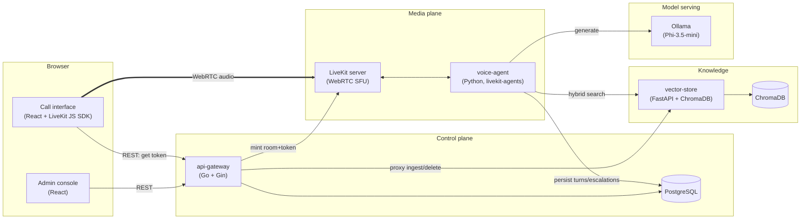

# Implementation Plan — Post-surgical voice agent (Tech Sphere 2026)

Companion to [`scaffolding.md`](./scaffolding.md). Source of truth for anyone (human or
subagent) picking up a workstream below — read §4 (contracts) before writing code against
a service you don't own.

## 0. Non-negotiable constraints (from `ParticipantArtifacts/docs/`)

These come from the actual grading rubric, not from `scaffolding.md`, and override any
convenience shortcut below:

- **G1** — repo, diagram, informe, video, all four, before anything else is scored.
- **G2** — `git clone` → running, from the README alone, **≤ 15 minutes**, timed. Model
  downloads count against this clock.
- **G3** — the reasoning LLM must be from an allowed family (Gemini Flash / Llama via
  Groq / Llama 3.x 1B–3B local / **Phi Mini 3.5+ local**, the one we're using) and this
  must be declared in the informe. Everything else (STT, TTS, embeddings, vector DB,
  orchestration) is unrestricted.
- **G4** — live two-way voice conversation, verified with a trivial exchange.
- **G5** — upload a doc from the console → agent uses it; delete it → agent forgets it,
  tested with a document outside the given corpus.
- **Clinical asymmetry** — a missed escalation (false negative) is the worst possible
  failure, scored far more harshly than a false alarm. Every escalation-adjacent design
  decision below is biased toward over-escalating, never under-escalating.
- README must report, verifiably against logs: **P50/P95 latency** (end of patient
  speech → start of agent audio), **tokens in/out per turn and per call**, **model calls
  per turn**, **RAG queries per call**, **estimated cost per call**.

Today (2026-08-08) sits inside the official build window (7–10 ago). The scope decision
on record is "build the full architecture," not an MVP cut — but the phase ordering in
§6 is still sequenced so that a gate-passing, submittable state exists as early as
possible. Treat §6's phase boundaries as safe checkpoints, not scope limits.

---

## 1. Architecture overview



**Why this shape, not a monolith:** `scaffolding.md` explicitly asks to decouple model
serving, vector storage, and the main API into separate services. The one addition beyond
that suggestion is **LiveKit as the WebRTC layer**, chosen over hand-rolled
Pion/signaling/ICE/jitter-buffer code because:

1. Full WebRTC (the chosen transport) is a large amount of genuinely hard, latency- and
   correctness-sensitive code (NAT traversal, echo cancellation, adaptive jitter
   buffering, barge-in/interruption handling) that a self-hosted, MIT-licensed,
   Docker-shippable SFU already solves.
2. `livekit-agents` (Python) gives us VAD, turn-detection, and interruption handling as
   library primitives instead of custom state machines — directly relevant to the
   "quality of voice conversation" rubric criterion (silences, interruptions, adversarial
   audio).
3. It keeps the real-time hot path to two network hops beyond the in-process pipeline
   (vector-store search, Ollama generate) — everything latency-critical (STT when local,
   TTS) runs in-process inside `voice-agent`, not as an extra service hop.

This is a genuine architecture decision with alternatives considered — worth citing
verbatim as the answer to the video's Question 2 (technical decision + alternatives +
risks).

### Service list

| Service | Language/runtime | Responsibility | Talks to |
|---|---|---|---|
| `frontend` | React + Vite + TS | Admin console + call interface (can be one SPA, two routes) | `api-gateway`, `livekit` (via JS SDK) |
| `api-gateway` | Go + Gin | REST control plane: call lifecycle, document CRUD proxy, escalation/summary reads, OpenAPI docs, LiveKit token minting | `postgres`, `vector-store`, `livekit` |
| `voice-agent` | Python + `livekit-agents` | Real-time pipeline: VAD → STT → retrieve → generate → decide → TTS; writes turns/escalations/summaries | `livekit`, `vector-store`, `ollama`, `postgres` |
| `vector-store` | Python + FastAPI + ChromaDB | Ingestion (parse/chunk/embed), hybrid search, versioning, soft delete | `chromadb` (embedded or its own container) |
| `ollama` | Ollama (Go binary) | Serves Phi-3.5-mini via OpenAI-compatible API; GPU/Metal/CPU auto | — |
| `livekit` | LiveKit server (Go binary, official image) | WebRTC SFU, room/token auth | — |
| `postgres` | PostgreSQL | Transactional data: documents, calls, turns, escalations, summaries | — |

---

## 2. Key technical decisions and rationale

### 2.1 LLM: Phi-3.5-mini via Ollama, behind a provider interface

Default and declared-in-informe model: `phi3.5:3.8b` (or the current successor tag in
the same family, per the stack doc's "families not snapshots" note — pin whatever
resolves at build time and log the resolved tag). Implemented behind a small
`LLMProvider` interface in `voice-agent` (`generate(messages, stream) -> tokens`,
`classify(context) -> {triage, confidence}`), with `OllamaProvider` as the only
implementation initially. This directly satisfies `scaffolding.md`'s "should be able to
handle multiple models and vendors, and switch between them as needed" and gives a clean,
honest answer if asked "what would you change with two more weeks": wire up
`GeminiFlashProvider` / `GroqLlamaProvider` behind the same interface for a cloud fallback
path.

### 2.2 STT: dual-mode, config toggle

- `groq` (default for the live demo): Groq Cloud Whisper Large V3, HTTP call from
  `voice-agent`. Near-instant, explicitly the reason Groq is in the stack doc.
- `local`: `faster-whisper` (CTranslate2), in-process in `voice-agent`, CPU or Metal/CUDA
  via the same hardware-detection logic as §2.5. Offline fallback and a legitimate answer
  to "what if there's no internet during grading."
- Selected via `STT_MODE` env var, same `STTProvider` interface pattern as the LLM.
  Latency and cost are logged per-turn regardless of mode, so the README's required
  metrics table works unmodified either way.

### 2.3 Escalation logic: hybrid, asymmetric-safe

Given "false negative is catastrophic" is an explicit, heavily-weighted rubric principle,
escalation decisions are **never LLM-only**:

1. **Track A (conversational)** — the model streams a natural-language Spanish reply,
   sentence-chunked straight into TTS as it generates, so audio starts before the full
   response is done. This is what keeps perceived latency low.
2. **Track B (classification)** — a concise structured pass (Ollama JSON-mode) over the
   same turn context produces `{triage: verde|amarillo|rojo, confidence, missing_info[],
   citations[]}`.
3. **Deterministic red-flag layer** — a rule table (fever thresholds, red-flag symptom
   keywords/regex per procedure category, e.g. chest pain, wound dehiscence signs, no
   bowel movement + vomiting) runs on the raw transcript independently of the LLM.
4. **Fusion rule**: `final_triage = max(track_B_triage, rule_layer_triage)` — the rule
   layer can only escalate, never downgrade what the model said. Every escalation event
   persists `rationale`, which layer triggered it, and the cited chunk IDs, satisfying
   both the escalation and traceability rubric criteria at once.
5. When Track B or the rule layer is ambiguous (low confidence, conflicting signals), the
   agent is prompted to **ask a clarifying question before deciding** rather than
   guessing — directly answers "¿indaga antes de decidir?" from the rubric.

### 2.4 Hybrid retrieval, versioning, soft delete

- **Dense**: BGE-M3 embeddings (via `FlagEmbedding` or `sentence-transformers`), stored in
  ChromaDB.
- **Sparse**: BM25 over the same chunk text (`rank_bm25`, or SQLite FTS5 if we want it
  queryable via SQL too).
- **Fusion**: Reciprocal Rank Fusion (RRF) over the two result lists — simple, tuning-free,
  good default for a 2-source hybrid.
- **Identity**: `api-gateway`/Postgres owns `document_id` (source of truth for identity);
  `vector-store` is a processing/index engine, not an ID authority. Every chunk in Chroma
  carries `{document_id, version, status}` metadata.
- **Versioning**: re-uploading a doc creates a new `document_versions` row and a new
  Chroma write tagged with the incremented version; old version's chunks flip to
  `status=superseded`.
- **Soft delete**: `DELETE /documents/{id}` flips Postgres `status=deleted` and Chroma
  metadata `status=deleted` for all that doc's chunks **synchronously**, before the
  request returns — G5 is tested live, retrieval must exclude it immediately. A later
  background GC job can physically purge; not needed for grading.
- Every search query filters `status="active"` — this is the single mechanism that makes
  "upload → agent uses it, delete → agent forgets it" true.

### 2.5 Hardware-aware serving (GPU/Metal/CPU)

- **Linux + NVIDIA**: `ollama` container gets `deploy.resources.reservations.devices`
  GPU passthrough (nvidia-container-toolkit). CPU fallback profile if absent.
- **macOS (Metal)**: Docker Desktop cannot pass Metal through to containers. `setup.sh`
  detects `uname -s == Darwin` and defaults to running `ollama` **natively on the host**
  (Metal-accelerated) instead of in Compose, pointed to by `OLLAMA_HOST` in the other
  services' env. Same reasoning applies to `voice-agent` when `STT_MODE=local` or Kokoro
  TTS wants Metal (via PyTorch MPS) — `setup.sh` offers a `--native-agent` mode that runs
  `voice-agent` via `uv run` on the host instead of in Docker, while everything else
  (postgres, livekit, vector-store, api-gateway, frontend) stays containerized. Document
  this trade-off explicitly in the README; it's a real, non-obvious constraint worth
  flagging rather than silently degrading to CPU everywhere on Mac.
- **CPU-only fallback**: always available, always the safety net for the timed G2 build.

### 2.6 Real-time transport detail

`voice-agent` joins each LiveKit room as a participant. `api-gateway` mints a
short-lived LiveKit access token per call (`POST /calls`) so the frontend never talks to
LiveKit's admin API directly. Interruption/barge-in uses `livekit-agents`' built-in VAD +
turn-detector rather than a custom implementation.

---

## 3. Data model

### 3.1 PostgreSQL (owned by `api-gateway` for `documents*`/`calls`; `voice-agent` writes
`turns`/`escalations`/`call_summaries` directly during a call — this split avoids proxying
every turn through Go and is safe because both are trusted internal services on the same
DB)

```
documents          (id uuid pk, title, category, status[active|deleted], current_version int, created_at)
document_versions  (id uuid pk, document_id fk, version int, storage_path, checksum,
                     status[processing|ready|failed|superseded], chunk_count int, processed_at)
patients           (id uuid pk, external_ref, name, procedure, surgery_date, ...)  -- optional demo seed from dataset
calls              (id uuid pk, patient_id fk null, started_at, ended_at,
                     status[active|completed|dropped], stt_mode, llm_model)
turns              (id uuid pk, call_id fk, role[patient|agent], text, audio_ref null,
                     stt_ms, retrieval_ms, llm_ms, tts_ms, tokens_in, tokens_out,
                     retrieved_chunk_ids text[], created_at)
escalations        (id uuid pk, call_id fk, level[verde|amarillo|rojo], rationale,
                     triggered_by[model|rule|both], cited_documents jsonb, created_at)
call_summaries     (id uuid pk, call_id fk unique, procedure, symptoms_reported,
                     decision, references jsonb, next_steps, created_at)
```

`turns.stt_ms/retrieval_ms/llm_ms/tts_ms` + `tokens_in/out` are what make the README's
required latency percentiles and consumption metrics computable with a straight SQL
query instead of hand-waved numbers — wire this in from the first working pipeline, not
retrofitted at the end.

### 3.2 ChromaDB

Collection `clinical_kb`, one entry per chunk, metadata:
`{document_id, version, chunk_index, category, lang, page, status}`.

---

## 4. Service contracts

These are the sync points between workstreams (§7) — treat as frozen once two
workstreams depend on them; change by agreement, not unilaterally.

### 4.1 `api-gateway` (Go+Gin), `/api/v1`, OpenAPI-documented

```
POST   /documents                 multipart upload -> {document_id, version, status:"processing"}
GET    /documents                 -> [{id, title, category, status, current_version}]
GET    /documents/{id}/status     -> {status, chunk_count}   (polled by console for "processed and available")
DELETE /documents/{id}            -> soft delete, synchronous
POST   /calls                     -> {call_id, livekit_room, livekit_token}
GET    /calls/{id}                -> call + turns + escalation + summary
GET    /calls/{id}/summary
GET    /escalations?level=rojo    -> alert list
GET    /metrics/summary           -> {p50_ms, p95_ms, tokens_in, tokens_out, rag_queries_per_call, est_cost_per_call}
POST   /internal/livekit/webhook  -> room/participant lifecycle events
```

### 4.2 `vector-store` (FastAPI), `/v1`

```
POST   /ingest   {document_id, version, file, category} -> {chunk_count, status}
DELETE /documents/{document_id}                          -> soft delete in Chroma, synchronous
POST   /search   {query, top_k, filters?} -> [{chunk_id, document_id, version, text, page, score, source[dense|bm25|both]}]
GET    /documents/{document_id}/status
```

### 4.3 `voice-agent` internal pipeline (not HTTP; documented for implementers)

```
VAD end-of-speech
  -> STT(audio) -> text                                   [Track: STT]
  -> POST vector-store/search(text)                       [retrieval]
  -> build prompt (system + citations + history window)
  -> Ollama generate, streamed                             [Track A: spoken reply -> TTS per-sentence]
  -> Ollama classify, JSON-mode                             [Track B: triage]
  -> deterministic red-flag check(text)                     [rule layer]
  -> final_triage = max(Track B, rule layer)
  -> persist turn + escalation (if any) to Postgres
  -> on call end: summarize -> persist call_summaries
```

---

## 5. Repository layout

```
/
├── docs/                        # architecture diagram (source), OpenAPI exports, runbook
├── specs/                       # this plan, scaffolding.md
├── scripts/
│   └── setup.sh                 # OS-detecting bootstrap (Linux/macOS), installs uv/docker checks, runs compose
├── docker-compose.yml
├── docker-compose.gpu.yml       # override: NVIDIA passthrough profile
├── .env.example
├── services/
│   ├── api-gateway/             # Go + Gin
│   ├── vector-store/            # Python (uv) + FastAPI + ChromaDB
│   └── voice-agent/             # Python (uv) + livekit-agents
├── frontend/                    # React + Vite + TS
└── infra/
    ├── livekit/livekit.yaml
    └── postgres/migrations/
```

Dataset: do **not** vendor the PDFs into this repo. `setup.sh` shallow-clones
`ParticipantArtifacts` (or expects `DATASET_PATH` pointed at an existing clone) as part of
the timed setup — measure this step explicitly, since it counts against the 15-minute
budget (§8 risk).

---

## 6. Phased build plan

Ordering exists to guarantee a gate-passing checkpoint exists as early as possible, not
to cut scope — every phase below is in scope per the recorded decision to build the full
architecture.

| Phase | Delivers | Gate checkpoint |
|---|---|---|
| **0 — Skeleton** | Repo layout, `docker-compose.yml` with all services stubbed (health checks only), `setup.sh` v1, Postgres migrations | none yet |
| **1 — Knowledge base** | `vector-store` ingest + hybrid search + versioning + soft delete; bulk-load the given corpus | — |
| **2 — Model serving** | Ollama serving Phi-3.5-mini, `LLMProvider` interface, basic non-streaming generate call wired end to end | G3 declarable |
| **3 — Voice MVP** | LiveKit up, `voice-agent` joins room, STT (Groq) → LLM → TTS (Kokoro) round trip, no RAG/decision logic yet, browser can talk to it | **G4 achievable** |
| **4 — RAG + decision logic** | Retrieval wired into the prompt, citations tracked, dual-track generation, red-flag rule layer, escalation persistence, structured call summary | core 20+20 rubric pts |
| **5 — Admin console** | Upload/list/delete/status UI wired to `api-gateway` → `vector-store`, live against a held-out test doc | **G5 achievable** |
| **6 — Call interface polish** | Big-button UI, mic/speaking indicators, interruption handling verified, adversarial input handling (regional slang, noisy audio, hostile/scared patient, prompt-injection resistance) | 15pt voice-quality criterion |
| **7 — Local STT + hardware profiles** | `faster-whisper` local mode, Mac-native Ollama/agent path, GPU compose override | robustness/portability |
| **8 — Observability + docs** | Latency/token/cost instrumentation surfaced via `/metrics/summary`, `docs/` architecture diagram + decision-flow diagram, OpenAPI exports, README with required metrics table filled from real measured runs | G1, G2 timing verified, informe evidence |
| **9 — Gate rehearsal** | Fresh-clone timed run of `setup.sh` (§9), adversarial test script against escalation logic, prompt-injection test script | final G1–G5 sign-off |

---

## 7. Parallel workstreams (for subagents)

Each row is independently startable once its "needs" column is available; everything
else can start immediately against the frozen contracts in §4.

| Workstream | Owns | Needs before starting | Produces for others |
|---|---|---|---|
| **A — Control plane** | `api-gateway`, Postgres migrations, OpenAPI spec | §3.1 schema (frozen) | `/api/v1` contract for frontend + LiveKit token flow |
| **B — Knowledge** | `vector-store`, ingestion/chunking, hybrid search, corpus bulk-load | §4.2 contract (frozen) | `/v1/search` + `/v1/ingest` for `voice-agent` and `api-gateway` |
| **C — Voice pipeline** | `voice-agent`: LiveKit integration, STT/LLM/TTS providers, decision logic, red-flag rules | §4.3 pipeline, B's `/search`, A's Postgres schema | working G4/G5-critical path |
| **D — Frontend** | Admin console + call interface (React) | A's OpenAPI spec, LiveKit JS SDK token flow | the two required "surfaces" |
| **E — Infra** | `docker-compose*.yml`, `setup.sh`, LiveKit config, hardware profiles, model preflight | rough service list (§1, already frozen) | the thing G2's clock measures |
| **F — Docs/evidence** | `docs/` diagram, decision-flow diagram, README metrics section, informe scaffolding | outputs from all others (late-phase) | entregables 02/03 |

Recommended parallelization: **A, B, E can start immediately in parallel.** C depends on
B's contract existing (not necessarily implemented) and can build against a mocked
`/search` response until B is real. D depends on A's contract existing similarly. F
starts once there's something to document, but its README metrics section should be
stubbed early (§0's required fields) so instrumentation isn't bolted on at the end.

---

## 8. Risks and mitigations

| Risk | Why it matters | Mitigation |
|---|---|---|
| **15-minute cold start** — model downloads (BGE-M3 ~2.2GB, Phi-3.5 ~2.2GB quantized, Kokoro ~350MB, faster-whisper if local) + corpus clone + image pulls | Hard eliminatory gate (G2), timed literally | Parallelize all downloads in `setup.sh` (not sequential `depends_on` chains), pin smallest acceptable quantizations, measure real elapsed time on a clean machine before submission, keep local-STT and Mac-native paths as documented alternates rather than default so the timed path is the lean one |
| **Docker on macOS has no Metal passthrough** | Silent CPU fallback would contradict the "GPU/Metal if available" requirement and hurt latency numbers | Native-host run path for `ollama`/`voice-agent` on Mac, documented and scripted, not manual |
| **Small model (Phi-3.5-mini) clinical reasoning quality** | Direct hit to "RAG, precisión clínica" (20pts) and hallucination penalty | Deterministic red-flag layer as a non-LLM safety net (§2.3); citations required in every clinical claim; explicit "I don't know, escalating to a human" path when retrieval confidence is low |
| **Full WebRTC complexity** | Chosen transport is the highest-risk item in scope | LiveKit absorbs the hard parts (§1); don't hand-roll signaling/ICE |
| **Dual STT adds surface area** | Two providers to keep working and instrumented identically | Shared `STTProvider` interface, same latency/cost logging regardless of mode, test both before submission |
| **Prompt injection during the live demo** | Explicitly anulls a rubric section if the agent obeys an injected instruction | System prompt with explicit non-negotiable scope boundary, red-flag/escalation logic runs independent of what the conversational track says, add adversarial prompt-injection cases to the pre-submission test script (§9) |

---

## 9. Pre-submission verification checklist

Run all of these against a **clean machine or clean Docker state**, not the dev
environment that's been running for two days:

- [ ] `git clone` (fresh dir) → `./scripts/setup.sh` → timed, ≤ 15 min, note the actual
      number in the README
- [ ] G3: confirm resolved Ollama model tag logged at startup matches an allowed family
- [ ] G4: open the call interface, say a greeting + trivial question, get a spoken answer
- [ ] G5: upload a document that is *not* in the given corpus, confirm the agent can
      answer from it; delete it, confirm the agent no longer can
- [ ] Escalation asymmetry: run at least one clearly-escalate, one clearly-not, and one
      ambiguous case (ambiguous should trigger a clarifying question, not a guess)
- [ ] Prompt injection: attempt to get the agent to ignore its scope mid-call
- [ ] Adversarial audio: background noise, regional slang, a hostile/scared-patient tone
- [ ] Pull `/api/v1/metrics/summary`, cross-check the numbers against what's written in
      the README — inconsistency here is explicitly penalized
- [ ] Diagram in `docs/` matches what's actually in `services/` — the rubric says the
      jury spot-checks this

---

## 10. Deliverables mapping

| Entregable | Where it comes from |
|---|---|
| **01 Repositorio** | this repo, public, README with setup + required metrics |
| **02 Diagrama** | `docs/architecture.md` (§1's diagram, kept in sync) + a decision-flow diagram of §2.3's escalation logic |
| **03 Informe final** | Phase 8/F: model declaration + rationale (§2.1), prompts/configs evidence, decision-log excerpts, demo screenshots |
| **04 Video** | Demo script drawn from §9's checklist; Q1 (business framing) and Q2 (§1's LiveKit decision is the strongest candidate answer — real alternatives considered, real trade-offs, real risks) |
